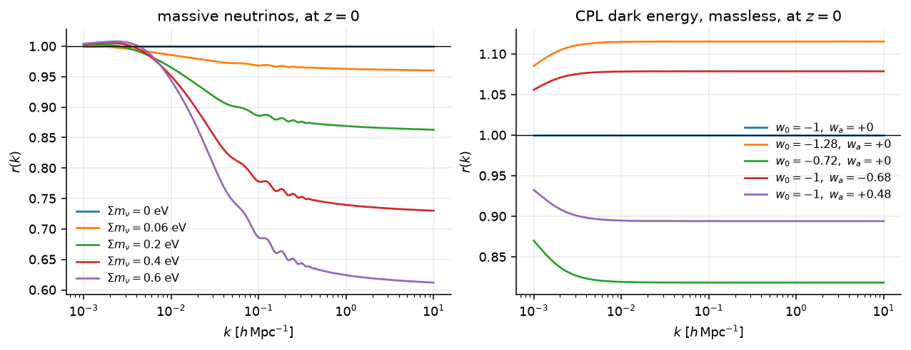

# Design notes

This is for someone reading or changing the source; using the package needs
none of it.

## The activation uses `jax.nn.sigmoid`, not `1/(1 + exp(-x))`

They agree to the last bit in *value* and not in *gradient*. Written out, the
reverse-mode derivative of the naive form carries
$e^{-\beta x}/(1+e^{-\beta x})^2$, and once $\beta x \lesssim -88$ the
exponential overflows to `inf` in float32: the value is still a correct `0` and
the gradient is `inf`/`inf` = `NaN`. `jax.nn.sigmoid` is the numerically stable
form and differentiates to $s(1-s)$, which is `0` there.

In a package whose entire purpose is that something differentiates it, an
activation that is differentiable only where it was tested is the worst
available defect. `tests/test_model.py` evaluates the gradient far into both
tails for this reason.

## The primordial power law is divided out of the training target

In linear theory with a power-law primordial spectrum,

$$\ln P(k,z) = \ln 10A_s + (n_s - 1)\ln\!\big(kh/k_*\big) + \ln T^2(k,z),$$

exactly: the transfer function does not know what $A_s$ or $n_s$ are, and both
solvers' linear spectra are that product; the heating ratio, taken between two
spectra with the same primordial power, cancels it. The network is given the
second term only and the first is added back by `model.primordial_ln_pk`.

Two consequences, and the second is the larger one. The derivatives
$\partial\ln P/\partial \ln 10A_s = 1$ and
$\partial\ln P/\partial n_s = \ln(kh/k_*)$ become *exact* rather than fitted —
a Fisher matrix built on this network is exactly right in two of its eleven
directions. And amplitude and tilt are the two largest variance directions in
the target over this box, so removing them is capacity the network gets back
for the transfer function, the BAO and the neutrino suppression.

That a solver's linear spectrum really does factorise this way is asserted
against CLASS itself in `tests/test_generate.py`, not assumed. If it were
false, every spectrum would be wrong by a smooth power law that nothing else in
the suite could see.

## `k_pivot` is stated, not left to a solver's default

It is the solvers' default value, but the training target is `ln P` with the
primordial power law divided out, which puts the pivot in the *inference* path,
and a pivot there cannot be a default: change a solver's and every shipped
weight file silently means a different spectrum, with nothing raising. It is
passed to CAMB (`pivot_scalar`) and to CLASS (`k_pivot`) explicitly, and written
into the `.npz` beside the weights trained against it.

Note the units: `k_pivot` is in **1/Mpc**, the solvers' convention, while
everything else in this package is in **h/Mpc**. The two meet in exactly one
expression, in `primordial_ln_pk`, which is where the factor of `h` lives.

## `validate.K_NORM` and `cosmo.K_PIVOT` are different things

They happen to share the number 0.05. `K_NORM` is where the shape comparison
renormalises and is in h/Mpc; `K_PIVOT` is the primordial pivot and is in
1/Mpc. The reduced target makes the second one load-bearing, so they carry
separate names even where they collide numerically.

## The correction table ships as a full cube, not two factors

A factorised table — a neutrino factor times a dark-energy factor — is far
cheaper: 2² and 2³ derivative arrays over small cubes against 2⁴ over a
1.8-million-element one. `assemble.build_ratio` builds the full grid and
measures the cross term a factorisation would discard, storing it as
`resid_max`. It reaches 1.61 % where the emulator's own shape error is 0.070 %,
which is why the table ships whole: the number is measured rather than
assumed.

The two effects couple physically — more late-time growth is more time for free
streaming to suppress — so the residual grows with the *product* of neutrino
mass and dark-energy deviation.

Each panel holds the other axis at its neutral value, so both are exactly 1 at
the massless ΛCDM corner. The table is indexed on $f_\nu$ and therefore does
not resolve the mass splitting; `emu_pk.ratio` is a correction for an emulator
that has neither neutrinos nor CPL, and the network is trained on the real
spectra directly.

## The interpolator carries every mixed partial

Carrying one slope array per axis is C¹ *at a node* in every axis, because the
Hermite coefficients multiplying the carried slopes vanish there. Between nodes
it leaves a 1.6 × 10⁻² jump in $\partial r/\partial w_0$; with all 2⁴ mixed
partials that becomes 4.7 × 10⁻⁷.

Both constructions are in `interp.py` and both are tested: the cheap one is
the evidence for the expensive one, and the test suite parametrises over
on-node *and* off-node, because the on-node case passes either way.

## $\Omega_m$ contains the neutrinos

$\Omega_\nu = \Sigma m_\nu/(93.143 h^2)$, and $\Omega_m$ includes it. That is
`ggah_mod`'s convention, and a table built in a different one is wrong in a way
no test on either side can see, because each is self-consistent.
`tests/test_conventions.py` is the seam: it asserts the two agree whenever
`ggah_mod` is importable.

The denominator is the rest mass of three states at CLASS's default
`T_ncdm = 0.71611`, derived rather than typed, exactly as `ggah_mod` 0.9.8
derives it. A rounded `93.14` typed on one side would leave two packages
subtracting different rest masses from $\Omega_m$ while each reports its own.

## The spectrum is interpolated with a cubic, and the metric reports its floor

`shape_error` asks the truth at 300 fresh log points while the network predicts
on `grid.k_grid`'s 411 nodes, so whatever happens *between* the nodes is scored
as network error. At six nodes per acoustic period in $\ln k$, linear
interpolation is an $O(h^2)$ error large enough to be the whole score.

Pushing a truth spectrum through the identical path — solve on the native grid,
interpolate to the scoring points, renormalise at `K_NORM`, max over $k$ — with
no network involved:

| interpolant | median | p90 | max |
|---|---|---|---|
| linear | 0.1045 % | 0.2253 % | 0.2483 % |
| **four-point cubic** | **0.0209 %** | 0.0333 % | 0.0342 % |

A ruler that reads 0.10 % cannot resolve a network at 0.06 %: under linear
interpolation the reported median would be the metric measuring itself, and no
quantity of design points or capacity could move it. A cubic on the same nodes
is $O(h^4)$ and puts the floor at a third of the network's error, which is where
a ruler belongs.

**Not the monotone cubic in `interp.py`**, though it suits this shape of
problem. Its Fritsch–Carlson limiter branches on the data, and here the data
is the network's own output — so the branch moves with $\theta$ and puts a kink
in $\partial P/\partial\theta$ at whatever cosmology it happens to switch.
That is the defect `model.activation` exists to avoid, and reintroducing it one
layer further out would be a poor trade. The fixed four-point stencil has no
branches on the node values at all: the result is a linear combination of four
of them, so the gradient is exactly as smooth as the network is. A test pins
that superposition holds.

`validate.interpolation_floor` reports the floor beside the number it bounds,
the way `derivative_error` reports its finite-difference floor. It calls
`model._catmull_rom` rather than reimplementing the interpolant: a floor
computed through a different path than the emulator's own measures that path
instead, and can land *above* the error it exists to bound.

## The validation split holds out whole cosmologies

Rows are `(cosmology, redshift)` pairs and `assemble` writes all 31 redshifts of
a solve consecutively, so a random 5 % *row* split would put nearly every
cosmology on both sides. `val_loss` would then measure interpolation in $z$
within cosmologies the network has already seen, not generalisation to new
ones.

The consequence would be worse than an optimistic number. `oarsub/README.md`
tells the reader to decide data-limited versus capacity-limited from the
train/val gap, and that is what a campaign steers on — but with the split
leaking, train and val track each other whichever is true, and the diagnostic
cannot answer the question it is there for.

The redshift axis has to *tile* — the first block of unique $z$ values repeating
exactly — rather than merely divide the row count, because a fixture that gives
every row its own redshift otherwise reads as one cosmology with a very long
redshift axis, and the whole of it goes to validation.

## The trainer's defaults are what the package ships

`train()` defaults to `direct=True` and `z_var="log10_1pz"`, which is what the
shipped checkpoint declares. The cluster submitter passes neither flag, so a
default that disagreed with the artefact would train a different model from the
one released, and on this quantity that costs a factor of 1.6: measured over
four ablations on one design, a PCA head on plain $z$ scores 0.1824 % against
0.1113 % for the direct head on $\log_{10}(1+z)$.

A divergence between a default and an artefact is invisible to a test that
looks at either alone, so four tests read the shipped checkpoint and assert the
signature agrees — including one that trains with no flags at all and reads
back what it declared, since a signature check alone would pass if `main()`
inverted a flag on the way through.

## The curvature scale sits inside the k grid

`K_MIN` is $10^{-4}\ h\,\mathrm{Mpc}^{-1}$ and the curvature scale is
$k_{\rm curv} = \sqrt{|\Omega_k|}\,H_0/c$, which at the edge of the box
($|\Omega_k| = 0.15$) is $1.29\times10^{-4}$. The grid reaches below it.

That matters because curvature is otherwise the cheapest axis in the box.
Measured with CLASS, above $k \approx 10^{-2}$ the response is a
*k-independent growth rescaling*: $\partial\ln P/\partial\Omega_k = -1.81$
across the box, flat in $k$ to better than 0.5 % over four decades. The
transfer function is fixed long before curvature matters, so $\Omega_k$ moves
only the growth — and the network already spans that direction. Solving 40
held-out cosmologies twice, once flat and once curved, the extra spread the
ninth parameter adds to the training target is:

| band [h/Mpc] | extra variance at z=0 | z=1 | z=3 |
|---|---|---|---|
| $10^{-4}$–$10^{-3}$ | **+91 %** | +69 % | +67 % |
| $10^{-3}$–$10^{-2}$ | +20 % | +12 % | +5 % |
| $10^{-2}$–$1$ | +3.2 % | +1.8 % | −0.7 % |
| $1$–$200$ | −3.7 % | −4.2 % | −2.9 % |

The negatives are sampling noise on 40 points, and they are the finding: over
almost all of the scored range, adding curvature does not widen the target at
all. The whole cost is in the lowest decade, where the response turns over,
crosses zero near $k \approx 6\times10^{-4}$, reaches $2.5$ in $\ln P$ at
$\Omega_k = +0.15$, and is **not monotonic in $\Omega_k$** — at $k = 10^{-4}$,
$\Omega_k = -0.05$ gives $-0.843$ and $-0.15$ gives $-0.635$. A smooth MLP has
to represent a saturating, sign-changing ridge there.

**`K_MIN` stays at $10^{-4}$ anyway**, for a reason that is not about this
package. `ggah_mod`'s `DIFFERENTIABLE` and `FAST` backends both quadrature
$\sigma(M)$ from $k_{\min} = 10^{-4}$, and `_interp_lnk` continues *below* the
grid as a power law with the slope of the bottom two nodes. For a flat
cosmology that continuation is roughly $k^{n_s}$ and is a safety net; for a
curved one it is wrong by construction, because the true slope there is steep,
sign-changing and $\Omega_k$-dependent. Raising `K_MIN` would not remove the
feature, it would move it into an extrapolation the consumer integrates over
and no test can see — the same shape of defect as the `jnp.interp` clamp this
package already carries a test for.

So the band is **scored instead**. `validate.K_LOWK` reports
$k \in [10^{-4}, 10^{-3}]$ separately from `K_TRUSTED`, and the headline
numbers keep their definition. Sixteen per cent of the network's
outputs live in that band, and scoring it is what makes the accuracy there a
stated limitation rather than an unchecked claim.

There is deliberately **no per-band weight in the trainer**. From the shipped
`feat_std_m`, the band is 64 of 411 modes carrying 18.6 % of
$\sum\mathrm{feat\_std}^2$, the curvature response included.
Per-wavenumber standardisation absorbs it, so a weight would be a knob with no
measured justification, and it would stop `val_loss` being the mean squared
error in $\ln P$ — which is the property that makes $\sqrt{\mathrm{val\_loss}}$
readable as an RMS fractional error at all.

## A checkpoint must feed every sampled parameter, not merely name known ones

`__init__` refuses a checkpoint naming an input this package does not know.
That is the easy direction. The dangerous direction is the other: a checkpoint
written against a *narrower* box names nothing unknown, so it loads, `_in_idx`
comes out bit-identical, and it predicts a spectrum that silently ignores
whatever axis the box has and the checkpoint lacks.

Growing the box is when that fires, on the very file the package ships. So the
absent case is refused too, with `ANALYTIC` — `ln10A_s` and `n_s`, which the
reduced target restores in closed form — as the one legitimate exemption.
`ANALYTIC` therefore lives in `model`, where the inference path can see it, and
`train` re-exports it: the trainer must drop exactly the inputs the predictor
is willing to find missing.

## A short `theta` is refused explicitly, because JAX will not refuse it

`_forward` reads its inputs with `p[self._in_idx]`. JAX does not raise on an
out-of-range index — it clamps — and a name-by-name check cannot catch a short
vector either, because zipping `box.PARAMS` against `params` stops at the
shorter. Without an explicit length check a `theta` one element short takes
some other parameter's value in the missing slot and returns a spectrum that is
finite, smooth and wrong.

The failure is quiet in the worst way: a caller written against a narrower box
gives `Omega_k` whatever `wa` holds, and since `wa = 0` is the common case the
answer looks right most of the time. So `predict` compares `len(params)` against
`len(box.PARAMS)` before anything else. `.shape` is static under `jit`, so the
check costs no tracing and does not touch the gradient.

## The box bounds carry float32 slack

`nu_r1`'s upper bound is 1/3. It is not a choice — it follows from the ordering
constraint $r_1 \le r_2 \le (1-r_1)/2$ — and `np.float32(1/3)` is
$9.9\times10^{-9}$ *above* it. The network runs in single precision, so an exact
comparison refuses the degenerate neutrino point $(1/3, 1/3)$ whenever `theta`
is built with `jnp.array`: the one point a reader is most likely to evaluate,
and the convention the degenerate approximation names.

`inside` therefore compares against the bound plus two float32 epsilons of the
axis's width. That is $2.4\times10^{-7}$ of a range, orders below any width at
which the fit changes and orders above the largest rounding the dtype can
produce. A bound is a statement about physics, and an exact comparison makes it
a statement about a bit pattern instead.

## The network's redshift input is `log10(1+z)`

$\mathrm{d}\ln P/\mathrm{d}\log_{10}(1+z) = -2\ln(10)\,f(z)$ with the growth
rate $f$ bounded in roughly $[0.5, 1]$, so `ln P` is nearly linear in this
variable with a bounded, monotonic slope. Measured with CLASS over
$z \in [0,5]$: departure from a straight line is 0.196 in $\log_{10}(1+z)$,
0.359 in $z$ and 0.782 in $a = 1/(1+z)$.

It matters because $z = 0$ is a node in *value* and an endpoint in *slope* —
nothing on the $z<0$ side constrains it — and a nearly straight function gives
a network very little reason to bend there. In this variable
$\partial\ln P/\partial z$ at $z=0$ is accurate to 0.112 %, against a
finite-difference floor of 0.040 %, and to better than 0.05 % everywhere else
in the range. $z=0$ remains the worst node, because it is the endpoint.

The transform is internal. `pk(k, z, ...)` takes a redshift and `jax.grad` of
it is still $\mathrm{d}/\mathrm{d}z$, by the chain rule.

## The output is standardised `ln P` per wavenumber, not PCA coefficients

This is what CosmoPower's own released linear-matter model does, and they
report having tested PCA against it and preferring the direct form. The reason
it matters here is not compression — the PCA residual is 7.6e-6, four orders
below the error — but that a basis makes every coefficient error *non-local in
k*. One bad coefficient is a wiggle across all 411 wavenumbers, and the metric
is the **max** fractional error over `k`.

Both forms are supported; the checkpoint declares which it is in
`output_form`, and loading a file under the wrong assumption would return a
spectrum rather than an error, so it is read and never inferred.

## The shipped file is the best epoch; the resume file is the last

They answer different questions. The validation curve is noisy at the
tens-of-per-cent level around a descending trend, so the last epoch is not
reliably the best one and shipping it is a coin flip nobody sees. A restart, by
contrast, has to continue from where training actually *is* — the optimiser
trajectory is a property of that, not of where it was best.

The resume file also carries the optimiser state, including the learning-rate
schedule's position. Without it a preempted run reinitialises Adam *and*
rewinds the schedule to its peak.

## The extras split is load-bearing

`import emu_pk` in an environment with no CAMB, no `classy` and no `optax` must
work, and `tests/` and CI assert it. That is what lets a downstream package
depend on this one without inheriting a Boltzmann solver or a training stack.
Generation and validation are `[gen]`, both solvers; training is `[train]`.

## `load_weights` is cached on the file's identity, not its path

Caching on the path is right until something rewrites that path, and then it is
silently wrong: retraining to the same filename and reloading returns the
previous network. The cache key includes mtime and size.

## The extrapolation above the grid is a power law, not a clamp

`jnp.interp` clamps at the edges, and a clamped linear spectrum is *flat* above
the last mode instead of falling as $k^{-3}\ln^2 k$. The grid reaches
300 h/Mpc, which is what the consumer integrates to, so the tail is a safety net
rather than a load-bearing extrapolation — but it is a net, not a cliff.

## The training truth is CAMB, and CLASS only supplies the heating

A network learns its training truth faithfully, error included, so the truth
has to be closer to converged than the network is to it. CLASS 3.3.4 at its
defaults is 0.41 % from its own converged answer in the median over this box,
0.81 % at worst, smoothly in the parameters, and no affordable CLASS setting
closes that at the heavy-neutrino end, where its ncdm fluid approximation
dominates above 0.3 eV. CAMB at `lAccuracyBoost = 3`, `AccuracyBoost = 2` and
no late radiation truncation — `ggah_mod` 0.9.8's setting — is 0.039 % from its
own converged rung. That is the training truth.

CAMB's linear $P(k)$ does not heat the baryons at reionization and CLASS's
does: 3 % at $k = 200\ h\,\mathrm{Mpc}^{-1}$ at the fiducial, 13 % at
`omega_cdm = 0.05`. So each CAMB spectrum is multiplied by CLASS's ratio
$P(\text{reio})/P(\text{no reio})$ from a pair at the same point. A ratio
cancels most of what a loose setting gets wrong, which is why the pair can run
at CLASS's own defaults: taken on CLASS's own $k$ nodes it is within 6e-5 of a
pair tightened everywhere. Taken after CLASS's $P(k)$ spline it would be 1.3e-3
off above 200, two spectra of different shape interpolated between nodes eleven
a decade apart.

## A validation against the training truth cannot see the truth's error

A network trained and validated on the same truth reports only its fit: on
CLASS at its defaults it would score about 0.06 % while sitting 0.4 % from a
converged answer. Both numbers would be true, and only the second is the
accuracy of the spectrum. So two records ship: `validation.json` against the
training truth, which measures the network alone and carries the derivatives,
and `validation_reference.json` against CAMB at a converged rung, which the
network was not trained on. The reference is half an hour of one core per
point, so it scores the shape and the tail only.

## A validation record carries the checksum of the weights it scored

`"weights": "shipped"` names whichever file is shipped *now*. Two networks can
agree on every other field of the record — epoch, forms, box — and differ in
every weight, so nothing else in the record pins down the bytes. Each record
carries `weights_sha256`, and a test compares it with the shipped file.

## The truth cache is keyed on rounded values

A reference solve is half an hour, and the cache is what makes scoring a second
network cheap: it is meant to be filled on a cluster and read elsewhere. The
scoring wavenumbers come out of `exp`, which numpy rounds differently with and
without AVX-512: 21 of 300 differ in the last bit between a cluster node and an
Arrow Lake laptop on the same numpy, so keys built on exact floats would never
match. The keys hash $\ln k$ to 1e-9 and the rest to 1e-10, far above that
noise and far below any difference that would be a different solve.

## CAMB is asked for each redshift once

CLASS evaluates $P(k)$ at any list of redshifts. CAMB integrates the transfer
functions to each requested redshift in turn, and a repeated one is a
zero-length step its integrator refuses with a DVERK error. `validate`'s
$\partial\ln P/\partial z$ stencils ask for $z = 0$ and $0.05$ at both step
sizes; passed as they are, CAMB would refuse all 16 points and the redshift
derivative would go unscored, with nothing louder than a count of zero.
`generate.solve_camb` passes the unique redshifts and matches rows back by $z$.

## Training on a GPU is at full float32

On an A100, JAX multiplies float32 matrices in TF32, ten mantissa bits, unless
told otherwise. A TF32 run with the same data, seed and schedule as a CPU run
tracks it to 0.2 % for the first epochs and then stops at a validation loss of
5.9e-7 against 3.7e-7, its *train* loss as high: a worse fit, not overfitting.
With `JAX_DEFAULT_MATMUL_PRECISION=highest` the first epochs agree with the
CPU's to four digits, and the shipped network is trained that way throughout.

`--host-targets` serves the same training set: its targets are 13.5 GiB, and
moving them onto a device takes twice that for a moment. Kept in host memory
and sent a batch at a time, the run is the same run bit for bit, and on a 16 GB
laptop card it is as fast as the A100, because a 4×512 network is limited by
per-step overhead rather than arithmetic.
