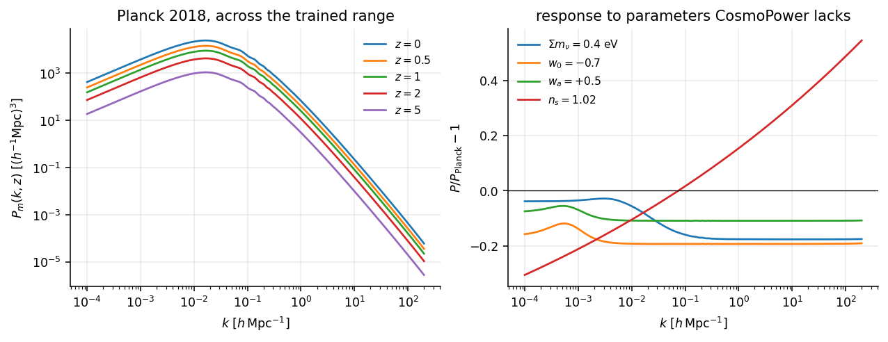

# The spectrum

`emu_pk` returns the linear matter power spectrum for a cosmology and a
redshift. The parameter vector is in `emu_pk.box.PARAMS` order:

```python
import numpy as np
from emu_pk import PkEmulator, box

print(box.PARAMS)
# ('omega_b', 'omega_cdm', 'h', 'n_s', 'ln10A_s', 'sum_mnu', 'w0', 'wa')

emu = PkEmulator()
k = np.logspace(-4, 2, 400)                      # h/Mpc
theta = np.array([0.02237, 0.1200, 0.6736, 0.9649, 3.044, 0.06, -1.0, 0.0])

pk = emu.pk(k, z=0.0, params=theta)
```



*Left:* $P_m(k,z)$ at the Planck 2018 cosmology across the trained redshift
range. *Right:* the fractional response to the three parameters CosmoPower's
`mpk_lin` does not carry, plus a tilt for scale. All at $z=0$, relative to the
Planck values.

The neutrino panel is the familiar step: free streaming suppresses power below
the free-streaming scale and saturates at high $k$. The textbook rule of thumb
is $\Delta P/P \approx -8f_\nu$; at $\Sigma m_\nu = 0.4$ eV, where
$f_\nu = \Omega_\nu/\Omega_m = 0.029$, that rule would give $-23\%$ and the
emulator gives $-20\%$, which is the usual size of the rule's error. What
matters downstream is that this is a *shape* change and not an amplitude one —
which is exactly why an emulator that cannot represent it cannot be rescued by
renormalising.

## Two spectra

Haloes form from the cold field, not the total one. Both are available:

```python
pk_m = emu.pk(k, 0.0, theta)          # total matter
pk_cb = emu.pk_cb(k, 0.0, theta)      # cold dark matter + baryons
```

They come from **one network with two output heads**, which is what stops them
drifting apart in a way that would show up downstream as a spurious
cold-versus-total effect. With $\Sigma m_\nu = 0$ they are identical, because
with no massive species the cold field and the total field are the same field.

## Many redshifts

Redshift is a network input, not a separate model, so asking for several costs
one vectorised evaluation:

```python
z = np.linspace(0, 5, 21)
pk = emu.pk(k, z, theta)              # (21, 400)
```

## Above the grid

The training grid reaches $k = 200\ h\,\mathrm{Mpc}^{-1}$, which is what a
halo-model $\sigma(M)$ integral needs. Above it the emulator continues as a
power law rather than clamping — `jnp.interp` would hold the last value, and a
clamped linear spectrum is *flat* where it should be falling as
$k^{-3}\ln^2 k$. That is a safety net here rather than a load-bearing
extrapolation, but it is a net and not a cliff.
