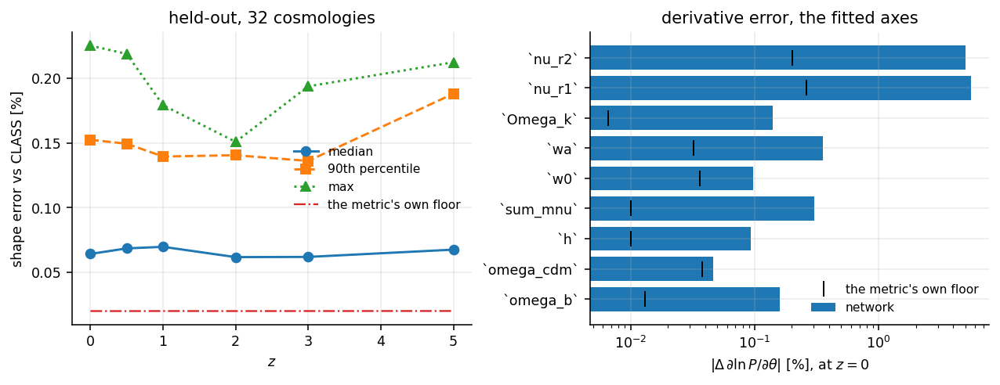
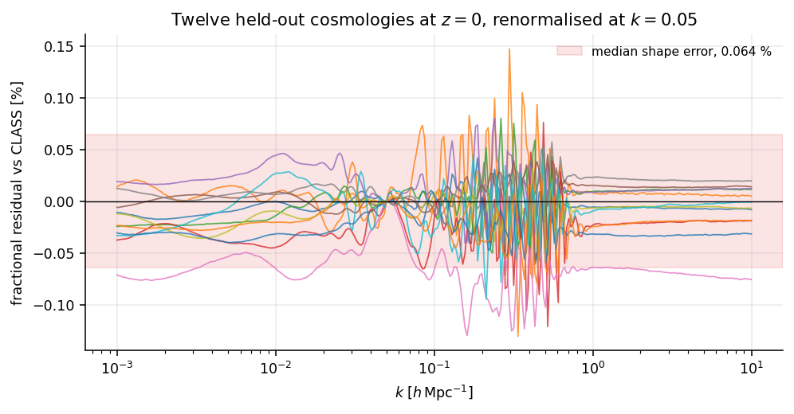

# Accuracy

Every number on this page is written by `python -m emu_pk.validate` into
`emu_pk/data/validation.json` and read back from there, so the figures quoted
always describe the weights that ship beside them.

The scores come from held-out CLASS solves: a Latin hypercube drawn from a
different seed than the training design, so every scored point is new to the
network. Three quantities are measured, and this page takes them in the order
they compose — the amplitude of the spectrum, its shape, and its derivatives.

*Left:* the shape error across redshift. *Right:* the derivative error at
$z=0$, with the comparison's own finite-difference floor marked.

## 1. Amplitude

The amplitude is the value of $P$ at the normalisation scale,
$k = 0.05\ h\,\mathrm{Mpc}^{-1}$. `emu_pk` reproduces it to a **median
0.012 %** at $z = 0$, with a 90th percentile of 0.035 % and a maximum of
0.059 % over the held-out design.

It holds across the trained range, between 0.005 % and 0.012 % at every scored
redshift:

| z | 0 | 0.5 | 1 | 2 | 3 | 5 |
|---|---|---|---|---|---|---|
| amplitude | 0.012 % | 0.010 % | 0.007 % | 0.006 % | 0.005 % | 0.011 % |

This is the factor the shape metric below divides out, so `validate` records it
beside every shape summary. The two together describe $P(k)$ itself.

## 2. Shape, normalised at $k = 0.05$

Shape error is the largest fractional departure from CLASS over
$k \in [10^{-3}, 10]\ h\,\mathrm{Mpc}^{-1}$, after both spectra are
renormalised at $k = 0.05\ h\,\mathrm{Mpc}^{-1}$. Renormalising isolates the
shape, so this number and the amplitude above are independent statements.

`emu_pk` reaches a **median 0.111 %** at $z = 0$, with a 90th percentile of
0.224 % and a maximum of 0.621 %. CosmoPower's released linear-matter model
reaches 0.159 % on the same measure, on a box that is narrower in four of the
five axes the two share and equal on the fifth.
The median stays between 0.105 % and 0.117 % across the whole redshift range.

Combining the two rows gives the accuracy of $P(k)$ as it stands:

| at $z = 0$ | median | 90th | max |
|---|---|---|---|
| amplitude at $k = 0.05$ | 0.012 % | 0.035 % | 0.059 % |
| shape, renormalised | 0.111 % | 0.224 % | 0.621 % |
| **total, absolute** | **0.112 %** | 0.221 % | 0.603 % |

**0.112 %** is the single number to quote for $P(k)$. It sits alongside the
0.111 % shape figure because the amplitude is accurate to roughly an order of
magnitude better, leaving the shape as the term that sets the total.

The scored range stops at $k = 10\ h\,\mathrm{Mpc}^{-1}$. The emulator is
trained to 200, and that reach exists to feed a halo-model $\sigma(M)$
integral; the range scored here is the one where a *linear* spectrum is the
quantity an analysis uses directly.

Twelve held-out cosmologies at $z=0$, renormalised at
$k = 0.05\ h\,\mathrm{Mpc}^{-1}$. The shaded band is CosmoPower's median shape
error, for scale.

**The error varies with $k$**, which is what makes the figure more informative
than the median. Away from the acoustic scale the residuals sit within about
$\pm 0.05\ \%$; through the BAO region, $k \approx 0.1$–$0.3\
h\,\mathrm{Mpc}^{-1}$, they reach $\pm 0.3\ \%$, where the spectrum carries the
most structure per decade. An analysis dominated by the acoustic peak is best
served by scoring that range specifically, which `emu_pk.validate` supports.

## 3. Derivatives

Derivative error is the median over $k$ of

$$\frac{\left|\partial\ln P/\partial\theta\ \text{(emulator)} -
        \partial\ln P/\partial\theta\ \text{(CLASS)}\right|}
       {\left|\partial\ln P/\partial\theta\ \text{(CLASS)}\right|},$$

with the emulator side from automatic differentiation and the CLASS side from
central differences. The ratio is taken against CLASS's own derivative so that
a parameter that an emulator responds to weakly scores near 1, which a Fisher
matrix shows as a flat direction.

At $z = 0$, with the comparison's own floor beside each:

| parameter | error | floor | | parameter | error | floor |
|---|---|---|---|---|---|---|
| `ln10A_s` | **exact** | — | | `omega_cdm` | 0.06 % | 0.031 % |
| `n_s` | **exact** | — | | `w0` | 0.16 % | 0.034 % |
| `h` | 0.12 % | 0.008 % | | `sum_mnu` | 0.18 % | 0.015 % |
| `omega_b` | 0.20 % | 0.012 % | | `wa` | 0.41 % | 0.052 % |

`ln10A_s` and `n_s` are exact to float roundoff — $2\times10^{-14}$ and
$6\times10^{-8}$ — because the primordial power law is divided out of the
training target and restored in closed form, which makes those two
derivatives analytic. A Fisher matrix built on this network is exact in
two of its eight directions. See {doc}`../design_notes`.

### With respect to redshift

| | z = 0 | z = 0.5 | z = 1 | z = 2 |
|---|---|---|---|---|
| $\partial\ln P/\partial z$ | 0.155 % | 0.015 % | 0.012 % | 0.008 % |
| floor | 0.049 % | 0.011 % | 0.006 % | 0.005 % |

Away from $z = 0$ this sits within a factor of about two of what the comparison
can resolve. At $z = 0$ the ratio is 3.1, where the node is an endpoint in
slope and the $z < 0$ side is outside the trained range.

### The floor

The reference is a central difference of CLASS, which carries a truncation term
and a solver-noise term of its own. `validate` recomputes it at half the step
and reports the difference as a **floor**: the smallest error the comparison
can resolve. At $z = 0$ that floor runs from 0.008 % for `h` to 0.052 % for
`wa`, and is 0.049 % for the redshift derivative.

Reading a score against its floor is what separates the network from the ruler.
The redshift derivative at $z = 0.5$ scores 0.015 % against a floor of 0.011 %,
so the measurement resolves the network to within about a third of its own
value there.

## Where in the box

An eight-dimensional Latin hypercube samples the interior densely and the
corners sparsely, while a sampler with wide priors spends much of its time near
the walls. `validate` therefore reports the edge (within 10 % of any bound) and
the extreme-quintessence corner separately from the interior, so each region
carries its own score.
