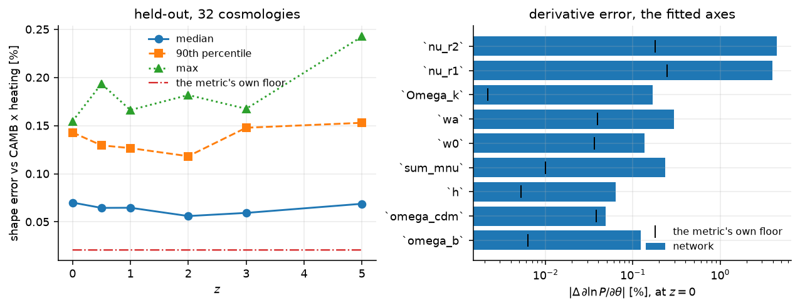
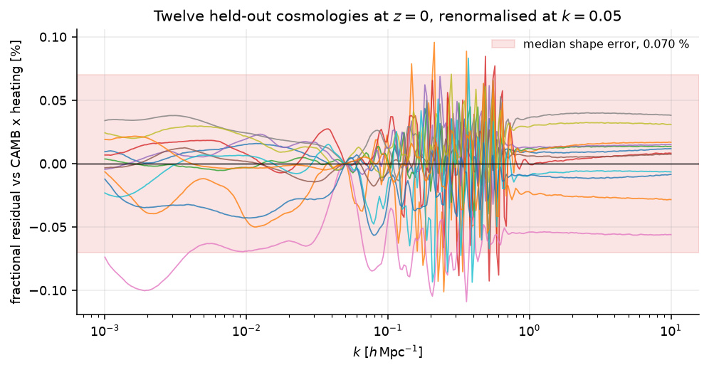

# Accuracy

Every number on this page is written by `python -m emu_pk.validate` into one of
two records that ship beside the weights, and both carry the checksum of the
weights file they scored. The scores come from held-out cosmologies, on a Latin
hypercube drawn from a different seed than the training design.

- `emu_pk/data/validation_reference.json` scores against **a converged
  reference**: CAMB at its converged precision rung, times the same reionization
  heating. Neither 2.0 nor 2.1 was trained on it, so it is the comparison
  between them, and the error it measures includes the error of the training
  truth itself.
- `emu_pk/data/validation.json` scores against **the training truth**: CAMB at
  the precision the network learnt, times the heating. It measures the network
  alone, and it is where the derivatives, the lowest decade and the floor of
  each comparison are.

## Against a converged reference

Total error in $P_m$, 32 held-out cosmologies, at $z = 0$:

| | median | 90th | max |
|---|---|---|---|
| $k \in [10^{-3}, 10]\ h\,\mathrm{Mpc}^{-1}$ | **0.063 %** | 0.130 % | 0.190 % |
| tail, $k \in [10, 300]\ h\,\mathrm{Mpc}^{-1}$ | **0.044 %** | 0.069 % | 0.086 % |
| *2.0.1, $k \in [10^{-3}, 10]$* | *0.351 %* | *0.580 %* | *1.358 %* |
| *2.0.1, tail to its own 200* | *0.494 %* | *0.565 %* | *0.629 %* |

From $z = 0$ to 5 the median stays between 0.051 % and 0.063 % and the worst
point at or below 0.198 %; the cold spectrum $P_{cb}$ scores 0.063 % at $z = 0$.
In the tail the median runs from 0.025 % to 0.052 %.

2.0 was 0.35 % off everywhere, smoothly: it was trained on CLASS at its
defaults, which `ggah_mod_benchmark`'s precision scan put 0.41 % from CLASS's
own converged answer, and a network learns its truth faithfully, error
included. Its validation was against the same default CLASS and could not see
it. The heavy-neutrino half of the box was worst, at 0.325 % in the median and
1.0 % at worst, where the ncdm fluid approximation dominates above 0.3 eV.

The converged reference costs half an hour of one core per point, so it is
scored on the shape and the tail only:
`python -m emu_pk.validate --truth reference`.

## The training truth

Everything from here on is `validation.json`: the network against the truth it
learnt, so it measures the network alone.

*Left:* the shape error across redshift. *Right:* the derivative error at
$z = 0$ for the nine fitted axes, with the comparison's own finite-difference
floor marked. `ln10A_s` and `n_s` are restored in closed form rather than
fitted and are left off; see {doc}`03_derivatives`.

## 1. Amplitude

The amplitude is the value of $P$ at the normalisation scale,
$k = 0.05\ h\,\mathrm{Mpc}^{-1}$, scored over 32 held-out cosmologies. At
$z = 0$ the median is **0.009 %**, the 90th percentile 0.026 % and the maximum
0.079 %. Across the trained redshift range:

| z | 0 | 0.5 | 1 | 2 | 3 | 5 |
|---|---|---|---|---|---|---|
| amplitude | 0.009 % | 0.017 % | 0.013 % | 0.012 % | 0.011 % | 0.009 % |

The shape metric below divides this factor out, so `validate` records it beside
every shape summary.

## 2. Shape, normalised at $k = 0.05$

Shape error is the largest fractional departure from the truth over
$k \in [10^{-3}, 10]\ h\,\mathrm{Mpc}^{-1}$, after both spectra are
renormalised at $k = 0.05\ h\,\mathrm{Mpc}^{-1}$, which makes it independent of
the amplitude above.

At $z = 0$ the median is **0.070 %**, the 90th percentile 0.143 % and the
maximum 0.155 %. The median stays between 0.056 % and 0.070 % across the
redshift range, and the cold spectrum $P_{cb}$ scores 0.058 % at $z = 0$.

| at $z = 0$ | median | 90th | max |
|---|---|---|---|
| amplitude at $k = 0.05$ | 0.009 % | 0.026 % | 0.079 % |
| shape, renormalised | 0.070 % | 0.143 % | 0.155 % |
| **total, absolute** | **0.064 %** | 0.131 % | 0.177 % |
| *the metric's own floor* | *0.021 %* | *0.033 %* | *0.034 %* |

**0.064 %** is the single number to quote for $P(k)$ against the training
truth; the amplitude is an order of magnitude better, so the shape sets the
total. The total's median sits slightly *below* the shape's: renormalising at
$k = 0.05$ moves the pivot's own small error onto every other wavenumber.

The floor row is the metric's own: a truth spectrum pushed through the
emulator's interpolation with no network involved. The network predicts on a
fixed 411-node $\ln k$ grid while the metric asks the solver at 300 other
wavenumbers, so what happens between the nodes is scored as network error. A
linear interpolant gives 0.11 % there, above the number it bounds, so
`model._interp_lnk` is a fixed four-point cubic. See {doc}`../design_notes`.

The headline range stops at $k = 10\ h\,\mathrm{Mpc}^{-1}$, below which a
*linear* spectrum is the quantity an analysis uses directly. The emulator is
trained to 300 to feed a halo-model $\sigma(M)$ integral, and `validate` scores
that tail, $k \in [10, 300]$, as its own band.

Twelve held-out cosmologies at $z = 0$, renormalised at
$k = 0.05\ h\,\mathrm{Mpc}^{-1}$. The shaded band is the median shape error
from the table above, for scale.

The error varies with $k$. Away from the acoustic scale the residuals reach
0.100 % below the pivot and 0.056 % above $k = 1\ h\,\mathrm{Mpc}^{-1}$; across
the BAO region, $k \approx 0.07$–$0.7\ h\,\mathrm{Mpc}^{-1}$, they reach
0.109 %, where the spectrum carries the most structure per decade.
`emu_pk.validate` scores a chosen band, for an analysis dominated by the
acoustic peak.

### The lowest decade

$k \in [10^{-4}, 10^{-3}]\ h\,\mathrm{Mpc}^{-1}$ is generated and trained on
but sits outside the scored range, and `validate` reports it separately:
median **1.15 %**, 90th percentile 2.01 %, maximum 4.81 %. Curvature acts
here and nowhere else — the curvature scale
$k_{\rm curv} = \sqrt{|\Omega_k|}H_0/c$ is $1.3\times10^{-4}\ h\,$Mpc$^{-1}$ at
the edge of the box, inside the grid rather than below it. Treat the decade
below $10^{-3}$ as indicative; {doc}`../design_notes` covers why `K_MIN` stays
at $10^{-4}$.

## 3. Derivatives

Derivative error is the median over $k$ of

$$\frac{\left|\partial\ln P/\partial\theta\ \text{(emulator)} -
        \partial\ln P/\partial\theta\ \text{(truth)}\right|}
       {\left|\partial\ln P/\partial\theta\ \text{(truth)}\right|},$$

the emulator side from automatic differentiation, the truth side from central
differences. The ratio is taken against the truth's own derivative, so an axis the
emulator responds to weakly scores near 100 % rather than near zero.

At $z = 0$, with the comparison's own floor beside each:

| parameter | error | floor | | parameter | error | floor |
|---|---|---|---|---|---|---|
| `ln10A_s` | **exact** | — | | `sum_mnu` | 0.234 % | 0.010 % |
| `n_s` | **exact** | — | | `wa` | 0.295 % | 0.040 % |
| `omega_cdm` | 0.048 % | 0.038 % | | `Omega_k` | 0.168 % | 0.002 % |
| `h` | 0.064 % | 0.005 % | | `nu_r1` | 3.93 % | 0.248 % |
| `w0` | 0.135 % | 0.036 % | | `nu_r2` | 4.46 % | 0.179 % |
| `omega_b` | 0.124 % | 0.006 % | | | | |

`ln10A_s` and `n_s` are exact by construction: the primordial power law is
divided out of the training target and restored in closed form, so neither is a
network input and the two derivatives are $1$ and $\ln(kh/k_\ast)$. They score
$1\times10^{-14}$ and $8\times10^{-6}$, which is what the float32 forward pass
and the solver's own finite difference leave behind. A Fisher matrix built on this
network is exact in two of its eleven directions.

The two mass ratios are the weakest axes at 4 %, and the ones with the least
signal to fit: splitting the sum unevenly moves $P(k)$ by 0.32 % at
$\Sigma m_\nu = 0.10$ eV and by under 0.012 % above 0.25 eV, so over most of the
box the effect is smaller than the emulator's own shape error.

The redshift dependence is not flat. `w0` and `wa` reach 1.39 % and 2.49 % at
$z = 5$, where CPL has least leverage on the expansion history, and `Omega_k`
reaches 0.333 %; `omega_cdm`, `h`, `omega_b` and `sum_mnu` are flat or improve.
`validate --z` scores any redshift on its own.

### With respect to redshift

| | z = 0 | z = 0.5 | z = 1 | z = 2 |
|---|---|---|---|---|
| $\partial\ln P/\partial z$ | 0.112 % | 0.022 % | 0.025 % | 0.018 % |
| floor | 0.040 % | 0.009 % | 0.007 % | 0.006 % |

Away from $z = 0$ this sits within a factor of two to four of what the
comparison can resolve. At $z = 0$ the ratio is 2.8, where the node is an
endpoint in slope and the $z < 0$ side is outside the trained range. Under the
CAMB truth this is scored from 2.1.0 on: before it, CAMB refused the stencil's
repeated redshifts and every point was skipped.

### The floor

The reference is a central difference of the truth, which carries a truncation term
and a solver-noise term of its own. `validate` recomputes it at half the step
and reports the difference as a **floor**, the smallest error the comparison
can resolve. At $z = 0$ that floor runs from 0.002 % for `Omega_k` to 0.248 %
for `nu_r1`, and is 0.040 % for the redshift derivative.

A score is read against its floor. `omega_cdm` scores 0.048 % against 0.038 %,
so the comparison barely resolves the network there; `sum_mnu` scores 0.234 %
against 0.010 %, twenty-three times its floor. A point whose finite-difference
step would cross a wall of the box is not scored on that axis, which is why
some axes count 15 of 16.

## Where in the box

An eleven-dimensional Latin hypercube samples the interior densely and the
corners sparsely, while a sampler with wide priors spends much of its time near
the walls, so `validate` scores regions separately. At $z = 0$:

| region | n | median | max |
|---|---|---|---|
| interior | 7 | 0.058 % | 0.089 % |
| edge (within 10 % of a bound) | 25 | 0.073 % | 0.155 % |
| extreme quintessence | 2 | 0.123 % | 0.145 % |
| $\lvert\Omega_k\rvert > 0.10$ | 8 | 0.091 % | 0.145 % |
| $\Sigma m_\nu < 0.30$ eV | 16 | 0.081 % | 0.153 % |
| $\Sigma m_\nu \ge 0.30$ eV | 16 | 0.059 % | 0.155 % |
| $\Omega_{\rm de} < 0$ | 0 | — | — |

The edge scores 1.3× the interior, the expected shape for a hypercube fit.

The strongly curved stratum, $\lvert\Omega_k\rvert > 0.10$, scores 0.091 %
against the box's 0.070 %: like the edge, it is a region the hypercube covers
thinly. The flat slice $\Omega_k = 0$ scores 0.064 %, so carrying the curvature
axis costs the other ten nothing. `validate --flat-only` produces that
comparison.

The degenerate neutrino point $r = (1/3, 1/3)$ is a vertex of the sampled
simplex rather than an interior point, so a hypercube almost never lands on it,
and it is where an analysis keeping the degenerate approximation sits. It is
scored as its own stratum for both reasons; this design lands one point there,
at 0.155 %.
