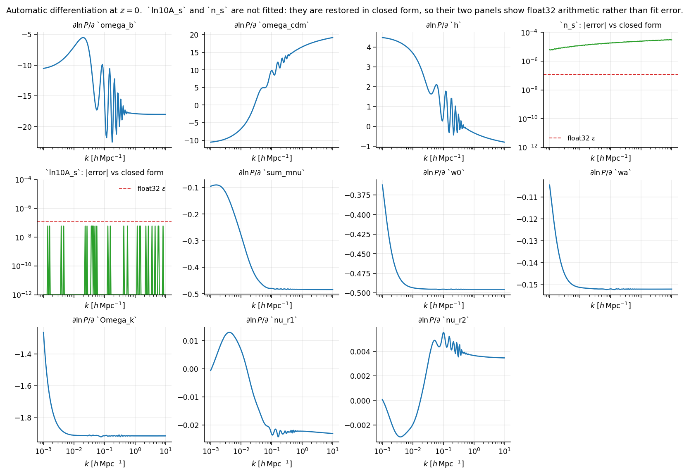

# Derivatives

This is what the package is for. An emulator that only returns values can be
replaced by an interpolation table; one that returns *trustworthy derivatives*
can be put inside a gradient-based sampler or a Fisher matrix.

```python
import jax
import jax.numpy as jnp
import numpy as np
from emu_pk import PkEmulator

emu = PkEmulator()
k = np.logspace(-3, 1, 200)
theta = jnp.array([0.02237, 0.1200, 0.6736, 0.9649, 3.044, 0.06, -1.0, 0.0, 0.0, 1/3, 1/3])

jac = jax.jacfwd(lambda t: jnp.log(emu.pk(k, 0.0, t)))(theta)   # (200, 11)
```



The baryon acoustic oscillations are visible in `omega_b`, `omega_cdm` and `h`,
which is the correct behaviour: those parameters move the sound horizon, so
their derivatives ring.

## Two of them are exact

`ln10A_s` and `n_s` are not learned. In linear theory with a power-law
primordial spectrum,

$$\ln P(k,z) = \ln 10A_s + (n_s - 1)\ln\!\big(kh/k_*\big) + \ln T^2(k,z),$$

exactly — the transfer function does not know what $A_s$ or $n_s$ are. The
network is trained on the last term alone and the first is restored in closed
form, so

$$\frac{\partial \ln P}{\partial \ln 10A_s} = 1, \qquad
  \frac{\partial \ln P}{\partial n_s} = \ln\!\big(kh/k_*\big)$$

hold by construction rather than to whatever the fit achieved — neither
parameter is a network input at all. In the figure those two panels show the
*residual* against the closed form, and what is left is arithmetic:
`ln10A_s` sits at $6\times10^{-8}$, one float32 epsilon, because it is an
additive constant; `n_s` sits at $3\times10^{-5}$, because its closed form is
added on the network's own $\ln k$ grid and then interpolated, and the cubic
stencil differences values of order 10 in single precision. Against a
derivative whose value is a few, that is a relative $10^{-5}$.

A Fisher matrix built on this network is therefore exactly right in two of its
eleven directions.

## With respect to redshift

$f\sigma_8$ is built from $\mathrm{d}\sigma_8/\mathrm{d}\ln(1+z)$, so the
redshift derivative is an observable, not a diagnostic:

```python
dlnP_dz = jax.jacfwd(lambda s: jnp.log(emu.pk(k, s, theta)))(0.5)
```

The network takes $\log_{10}(1+z)$ internally — that is the variable $\ln P$ is
nearly linear in, since
$\mathrm{d}\ln P/\mathrm{d}\log_{10}(1+z) = -2\ln(10)f(z)$ with the growth rate
$f$ bounded in roughly $[0.5, 1]$. The transform is internal and the chain rule
handles it, so `jax.grad` of `pk` is still $\mathrm{d}/\mathrm{d}z$.

## Under jit and vmap

```python
from emu_pk import box

thetas = box.sample(64, seed=0)                  # (64, 11), a Latin hypercube

@jax.jit
def spectrum(params, redshift):
    return emu.pk(k, z=redshift, params=params)

# in_axes=(0, None): map over the rows of `thetas`, hold the redshift fixed.
batch = jax.vmap(spectrum, in_axes=(0, None))(jnp.asarray(thetas), 0.5)
batch.shape                                      # (64, len(k))
```

The box check is skipped under tracing, where the values are not available —
attempting it there would raise `ConcretizationTypeError` and break the
gradient. Check the box once, outside the trace, when you build the jitted
model.

## A caution

The derivative errors in the validation record are *medians over $k$*, at the
fiducial redshift grid. They are small, but they are not zero, and they are not
flat in redshift: `w0` runs from 0.097 % at $z = 0$ to 1.50 % at $z = 5$ and
`wa` from 0.353 % to 1.76 %, where the CPL parameterisation has least leverage.
Most other axes are flat or improve. If your forecast is dominated by one
parameter at one redshift, score that configuration rather than trusting the
$z = 0$ number — `emu_pk.validate` takes `--z` and will do it.
