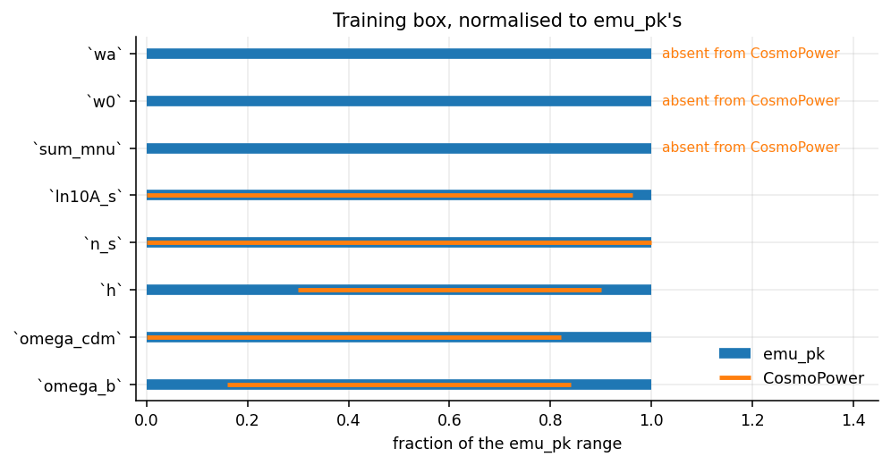

# The box, and its edges

A neural emulator is valid inside the box it was trained on and nowhere else.
Outside it the network does not fail — it *extrapolates*, returning a number
that is finite, smooth and unwarranted. So the box is data, checked on every
call that can afford to look, rather than a sentence in a docstring.



```python
from emu_pk import box

box.PARAMS      # the order everything downstream reads
box.BOX         # {name: (low, high)}, closed and inclusive
```

## Checking a point

```python
import numpy as np
from emu_pk import box

theta = np.array([0.02237, 0.1200, 0.6736, 0.9649, 3.044, 0.06, -0.2, 0.0])

box.inside(theta)
# {'w0': (-0.2, (-1.5, -0.5))}      empty when the point is inside

box.check(theta)
# ValueError: outside the emulator training box, where the network
# extrapolates with no accuracy guarantee: w0 = -0.2 not in [-1.5, -0.5].
```

`PkEmulator` calls `check` for you on every call where the values are concrete.
Under `jax.jit` the values are tracers, so the check is *skipped* rather than
attempted — see {doc}`../design_notes`.

## Drawing a design

```python
design = box.sample(1000, seed=12345)     # (1000, 8), Latin hypercube
```

Deterministic in the seed: a design is reproducible from the seed alone, so a
shard can be regenerated years later without shipping the design matrix, and
two workers can never disagree about which cosmology index *i* means.

Points with `w0 + wa >= 0` are rejected and redrawn. That is not a taste
constraint: with `w0 + wa >= 0` the CPL dark-energy density grows without bound
towards early times, dark energy dominates before recombination, and CLASS
either refuses or returns a spectrum that is not a cosmology anyone means to
train on.

## Where it is thinnest

Two places, and both are reported separately by `emu_pk.validate`:

**The walls.** An eight-dimensional Latin hypercube essentially never samples a
corner. The design's points are stratified, so they cover each axis evenly, but
a point near the wall *in every axis at once* does not occur. A sampler with
wide priors will visit places the training set did not.

**The extreme-quintessence corner.** With `w0` near $-0.5$ and `wa` positive,
`w(a)` climbs toward zero at early times. CLASS refused about 0.02 % of the
training solves there, all of them in that one corner, so the training set has
a small hole exactly where a forecast is most likely to wander. The generator
records failures rather than filling them, because a set with silent gaps
trains perfectly well and is wrong in a place nothing points at.
