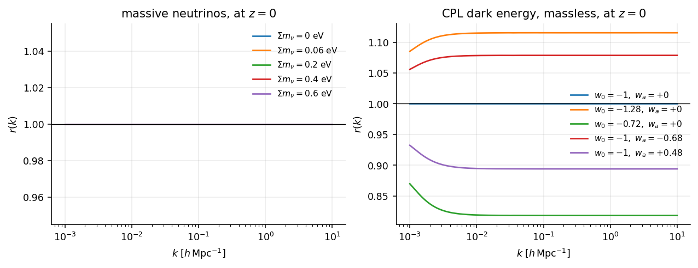

# The correction table

`emu_pk`'s own network is trained on massive-neutrino w0waCDM spectra directly,
so it needs no correction. The table exists for the other case: giving an
emulator that carries *neither* massive neutrinos nor dark energy a response to
both.

That case is not hypothetical. An emulator trained on massless ΛCDM returns
$\partial P/\partial w_0 = 0$ — not a small response, an absent one, which in a
Fisher matrix reads as a flat direction.



```python
import numpy as np
from emu_pk import ratio

k = np.logspace(-3, 1, 200)
f_nu = 0.06 / (93.14 * 0.6736**2) / 0.31          # Omega_nu / Omega_m

r = ratio.suppression_m(k, z=0.0, f_nu=f_nu, w0=-0.9, wa=0.1)
p_corrected = p_massless_lcdm * r
```

The ratio is measured from CLASS on a grid in
$(\Sigma m_\nu, w_0, w_a, z, k)$ and interpolated with a tensor-product Hermite
scheme, so it is C¹ in every axis.

## Exactly one at the ΛCDM massless corner

The stored log-ratio is *exactly* zero at $f_\nu = 0$, $w_0 = -1$, $w_a = 0$.
That is what lets the correction be applied unconditionally, with no
`if sum_mnu > 0` branch — and that matters because a Python branch on
$\Sigma m_\nu$ is a branch on a value that is a tracer under `jax.grad`, and
would break the gradient the differentiable path exists to provide.

## It refuses rather than clamping

Outside the grid, interpolation would clamp and silently understate the
correction:

```python
ratio.suppression_m(k, 0.0, f_nu, w0=-0.5, wa=0.0)
# ValueError: w0 = -0.5 is outside the distilled table's range [-1.3, -0.7].
```

A plausible wrong number is worse than an exception. Note that the table's
range is narrower than `emu_pk`'s own training box — the table was built for a
different purpose and its grid was sized for it.

## Indexed on $f_\nu$, not $\Sigma m_\nu$

The neutrino axis is the *fraction* $\Omega_\nu/\Omega_m$ rather than the mass,
so one table serves every $h$ and $\Omega_m$ instead of being tied to the
cosmology it was built at.

$\Omega_m$ **contains the neutrinos** here, with
$\Omega_\nu = \Sigma m_\nu/(93.14 h^2)$. A table built under a different
convention is wrong in a way no test on either side can see, because each is
self-consistent — which is why `tests/test_conventions.py` asserts the two
agree against the consuming package whenever it is importable.
